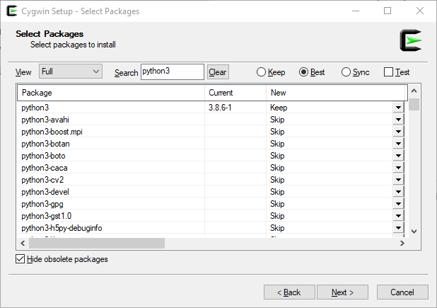
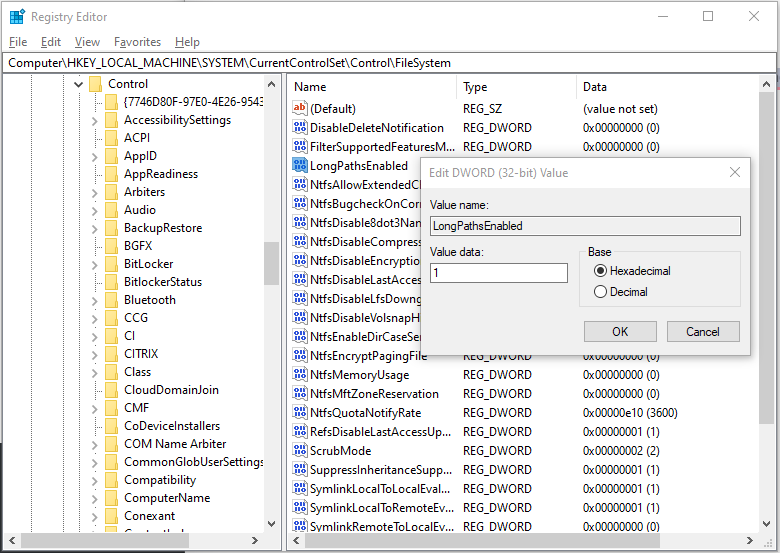
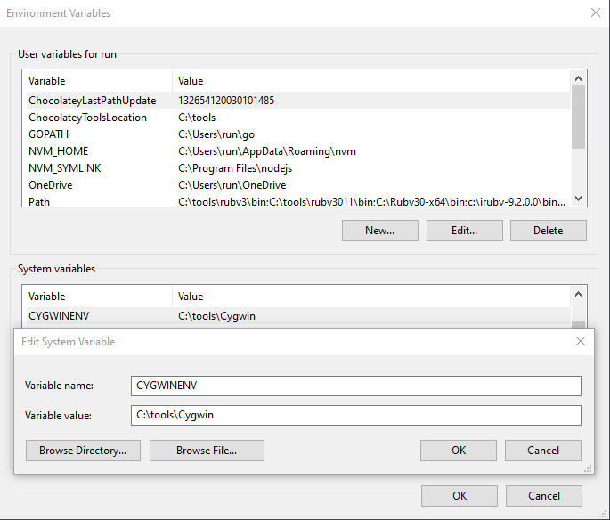
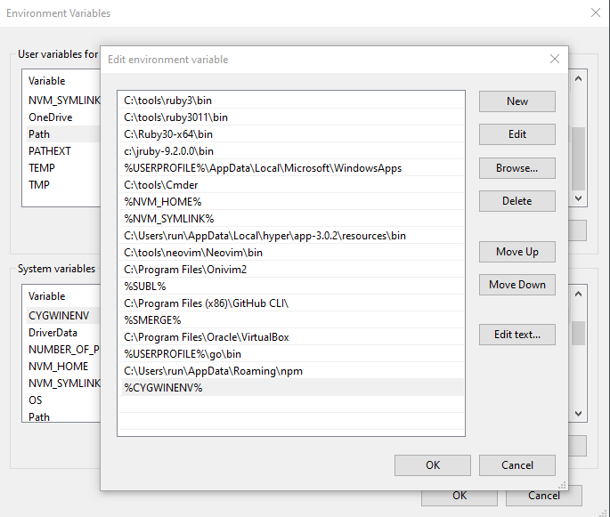

# Vagrant and the Ansible Provider on Microsoft Windows

Please note: This document describes one of many ways to make Vagrant and Ansible playing together on Microsoft Windows. It is written with the intention to find a way that is compatible with as many Microsoft Windows hosts as possible. ***If you have questions, improvements, or found a bug, please file an issue.***

## Opinion 

When it comes to Microsoft Windows, ***Vagrant and its Ansible Provider*** aren't a good team because Windows is sitting behind. In a Google search, you can find many suggestions and tutorials making them play together - especially with the help of Microsoft's WSL platform. However, in my opinion, they all ending in a mess. Don't touch WSL at all! *So, what can we do? In short: migrate to https://chef.io[Chef.io] or a similar tool with full support for Microsoft Windows. If you are, like me, bound to Ansible in some projects, follow this tutorial.*

First of all, I think there is no (technical) reason why Ansible and Microsoft Windows can't play together for the development in the Vagrant context - except corporate policies and corporate disinterest, maybe. In my opinion, on the one hand, RedHat, owned by IBM, won't make Ansible fully compatible with Microsoft Windows. On the other hand, Microsoft prefers to develop WSL to attack Linux instead of fixing long-term bugs of its operating system, Windows. And in between, we have HashiCorp and Vagrant, which have to deal with this situation as well as possible.

## Introduction

If you try to run *Vagrant with the Ansible Provider* on (native) Windows, you're ending up with this message:

```text
# ...
==> default: Running provisioner: ansible...
Windows is not officially supported for the Ansible Control Machine.
Please check https://docs.ansible.com/intro_installation.html#control-machine-requirements
Vagrant gathered an unknown Ansible version:


and falls back on the compatibility mode '1.8'.

Alternatively, the compatibility mode can be specified in your Vagrantfile:
https://www.vagrantup.com/docs/provisioning/ansible_common.html#compatibility_mode
    default: Running ansible-playbook...
The system cannot find the path specified.
Ansible failed to complete successfully. Any error output should be
visible above. Please fix these errors and try again.
```

To solve this issue and run your Ansible playbooks against your Vagrant VM also on Windows, I'll now navigate you through a solution I got up and running on an increasing number of Windows hosts. I don't say that's the best solution nor the only one. Instead, I try to give you a way that is also working for you.

## Install Cygwin

* Go to https://www.cygwin.com/[Cygwin's website] and download the installer to your `Downloads` folder.
* Double-click the installer and install Cygwin in its recommended place `C:\cygwin64`.

## Install the required Cygwin packages for Ansible

***Please notice: Currently, the last version of Python, which Cygwin supports, is 3.8. I'll do all further steps based on this version. Feel free to use a newer version but don't forget to change the Python version in all further steps.***

Cygwin is using its installer to install *and update* Cygwin. Each time you want to install additional packages, you have to run the Cygwin installer. So, head over to your `Downloads` folder and rerun the Cygwin installer.

Click through the installation steps until the _"Select packages"_ window appears and change to the View _"Full."_ Now you have to select the following packages to install (use the drop-down in the column _"New"_):

* `python3`
* `python38-crypto`
  * Optional: `python38-asn1crypto`, `python38-cryptograhy`
* `python38-paramiko`
* `python38-setuptools`
  * Optional: `python-setuptools-wheel`
* `gcc-g++`
  * Optional: `gcc-core`
* `openssh`
  * Optional: `openssh-debuginfo`
* `wget`
  * Optional: `wget-debuginfo`



Now that you have selected all necessary packages for Ansible, click _"Next"_ and finish the installation process.

## Prepare the Cygwin Environment

* Go to `C:\cygwin64` and run `Cygwin.bat` _as Administrator_ to make sure, your Cygwin user folder and environment is fully operational. If you see no errors, exceptions or warnings, quite the Cygwin shell.
* Take your favorite text editor, open the `.bashrc` file of your Cygwin user (located in `C:\cygwin64\home\__USER__`), and add these lines at the end:

```bash
# Python HOME
# export PYTHONHOME=/usr
export PYTHONPATH=/lib/python3.8

alias pip='python3 -m pip'
```

* `PYTHONHOME` is the location of Python at runtime. _Enable this variable only if you have a reason for it._
* `PYTHONPATH` points Python to additional directories holding private libraries. In the context of Cygwin, Python gets installed in the `lib` folder of Cygwin, and we have to make sure, Python recognizing this fact.
* In the third line, we're map the `pip` command correctly into our Cygwin environment.

But why we have to set this? Depending on your environment, it's maybe optional. Settings these  properties makes sure we have no conflicts with possible "native" Python installations on Microsoft Windows (for instance in `C:\Python39\python.exe`).

### Optional but recommended

Microsoft Windows may have a problem with the long filenames which are used by Cygwin sometimes. To prevent time-consuming errors relying on long path names, set the Windows registry value of `LongPathsEnabled` in `HKEY_LOCAL_MACHINE\SYSTEM\CurrentControlSet\Control\FileSystem` to `1`.



##  Make `ansible` and `ansible-playbook` accessible for the PowerShell

You may want to use `ansible` also in the context of PowerShell and not only in the Cygwin shell. To achieve this, we have to make sure we're running Ansible in Cygwin's bash context each time it is called. To do so:

* Create a directory called `Cygwin` in `C:\tools\`. If `C:\tools\` does not already exists, create it.
* Put the following two files in `C:\tools\Cygwin`:

`ansible.bat`:

```bat
@echo off

set CYGWIN=C:cygwin

REM You can switch this to work with bash with %CYGWIN%binzsh.exe
set SH=%CYGWIN%/bin/bash.exe

"%SH%" -c "/usr/local/bin/ansible %*"
```

`ansible-playbook.bat`:

```bat
@echo off

set CYGWIN=C:cygwin

REM You can switch this to work with bash with %CYGWIN%binzsh.exe
set SH=%CYGWIN%/bin/bash.exe

"%SH%" -c "/usr/local/bin/ansible-playbook %*"
```

Add `C:\tools\Cygwin` to Windows's _System Variables_:



Add `C:\tools\Cygwin` to your user's path:



## Let Cygwin access the insecure private key of Vagrant

Run `C:\cygwin64\Cygwin.bat` _as Administrator_ and create a Symlink from your Cygwin home to the `.vagrant.d` directory in your Windows User's home:

```bash
# Replace __USER__ with your user name
ln -s /cygdrive/c/Users/__USER__/.vagrant.d/ /home/__USER__/.vagrant.d
```
## Create the `ansible.cfg`

Create your "main" configuration file for Ansible in your Cygwin environment:

* Go to `C:\cygwin64\home\__USER__`
* Create the file `.ansible.cfg` with the following contents:

```bash
[ssh_connection]
control_path = /tmp
```

* Go to `C:\` and create the directory `C:\tmp\`

## Prepare your inventory file

In some cases, it may be helpful to create a dedicated inventory file just for Windows. However, you can also modify an existing inventory file. To make your inventory file ready to run in Cygwin's environment, first ask Vagrant for its SSH configuration. Open your Cygwin shell, go to your Vagrant project root and run:

```bash
vagrant ssh-config

# Output:
Host default
  HostName 127.0.0.1
  User vagrant
  Port 4000
  UserKnownHostsFile /dev/null
  StrictHostKeyChecking no
  PasswordAuthentication no
  IdentityFile C:/Users/__USER__/.vagrant.d/insecure_private_key
  IdentitiesOnly yes
  LogLevel FATAL
```

Update your inventory file with the results from `vagrant ssh-config`:

```bash
[server]
127.0.0.1

[server:vars]
ansible_user=vagrant
# ansible_ssh_pass=vagrant # Optional
ansible_ssh_private_key_file=~/.vagrant.d/insecure_private_key
ansible_connection=ssh
ansible_port=4000
ansible_debug=1
```

## Prepare your `Vagrantfile`

As far as I know, there is no way to suppress Vagrant's warning of "Windows is not officially supported for the Ansible Control Machine." Instead, I suggest to working around it in excluding the provisioner of Ansible in your `Vagrantfile` when running on Windows and run Ansible afterward. To do so, modify your `Vagrantfile` along with the following template:

```ruby
# -*- mode: ruby -*-
# vi: set ft=ruby :
# frozen_string_literal: true

VERSION = '2'

module OS
  def self.windows?
    (/cygwin|mswin|mingw|bccwin|wince|emx/ =~ RUBY_PLATFORM) != nil
  end

  def self.mac?
    (/darwin/ =~ RUBY_PLATFORM) != nil
  end

  def self.unix?
    !OS.windows?
  end

  def self.linux?
    OS.unix? and not OS.mac?
  end
end

Vagrant.configure(VERSION) do |config|
  # # Your configuration, for example:
  #
  # config.vm.box = 'debian/buster64'
  #
  # # Set the provider to host the VM
  # config.vm.provider 'virtualbox' do |vm|
  #   vm.gui = false
  #   vm.memory = 2048
  # end
  #
  # ...

  if OS.windows?
    puts "Vagrant launched on Microsoft Windows. 'config.vm.provision' ignored!"
  else
    puts "Vagrant launched from #{OS.mac || OS.unix || OS.linux || 'unknown'} platform."

    # Provisioning configuration for Ansible.
    config.vm.provision 'ansible' do |ansible|
      ansible.playbook = './ansible/main.yml'
      ansible.inventory_path = './ansible/develop.ini'
    end
  end
end
```

## Last step: Run it!

To run Vagrant and Ansible in two steps, we create a little Shell script for the Cygwin environment:

`vagrant-win.sh`:

```bash
!#/usr/bin/env bash

set -x -e

vagrant up --provision # --provider virtualbox
ansible-playbook -i __INVENTORY__ --ssh-extra-args='-p 4000 -i /cygdrive/c/Users/__USER__/.vagrant.d/insecure_private_key' --ssh-common-args='-o UserKnownHostsFile=/dev/null -o StrictHostKeyChecking=no -o PasswordAuthentication=no -o IdentitiesOnly=yes' __PLAYBOOK__
```

Replace `__INVENTORY__` with the path to your inventory file, `__PLAYBOOK__` with the path to your playbook entry file, and `__USER__` with your user name and save the file in the same place as the `Vagrantfile` of your project.

OK! Great job, you are ready to start your VM and provision afterward. Do this in the Cygwin shell (_as Administrator_). Let's go:

```bash
. ./vagrant-win.sh
```
